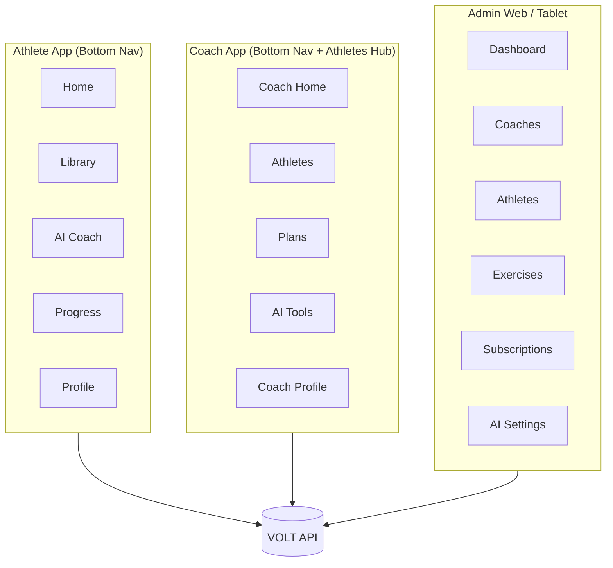

# Information Architecture & Screen Inventory

## Personas & primary surfaces



---

## Athlete — bottom navigation map

| Tab | Root screen | Key children |
|-----|-------------|--------------|
| **Home** | Athlete Dashboard | Next Workout, KPIs, AI Insight, Charts |
| **Library** | Exercise Library | Search, Filters, Exercise Detail |
| **AI Coach** | AI Hub | Chat, Generate Plan |
| **Progress** | Progress Hub | Photos, Measurements, Analytics |
| **Profile** | Profile & Settings | Goals, Coach link, Settings |

---

## Coach — navigation map

| Tab / Area | Root | Key children |
|------------|------|--------------|
| **Home** | Coach Dashboard | Alerts, adherence summary |
| **Athletes** | Athlete List | Search, filters, athlete profile |
| **Plans** | Plan Library | Builder, assign, templates |
| **AI** | Coach AI assist | Bulk insights, plan draft |
| **Profile** | Coach settings | Subscription, branding |

*Coach uses same visual system; “Athletes” replaces “Progress” in tab bar or adds top switcher Athlete/Coach mode.*

---

## Admin — structure (tablet-first)

```
Admin
├── Dashboard (KPIs: coaches, MRR, AI usage)
├── Coaches (list, detail, suspend)
├── Athletes (global search)
├── Exercises (CRUD, approve community)
├── Subscriptions (plans, invoices)
└── AI Settings (models, limits, prompts)
```

---

## Complete screen inventory

### Authentication (all roles)
| ID | Screen |
|----|--------|
| A01 | Splash |
| A02 | Onboarding 1–3 |
| A03 | Login |
| A04 | Register (role select) |
| A05 | Forgot password |
| A06 | Reset password |
| A07 | Email verification |

### Athlete
| ID | Screen |
|----|--------|
| AT01 | Dashboard Home |
| AT02 | Next Workout Detail |
| AT03 | Active Workout |
| AT04 | Workout Complete |
| AT05 | Exercise Library |
| AT06 | Exercise Detail |
| AT07 | Progress Hub |
| AT08 | Progress Photos Timeline |
| AT09 | Photo Capture Flow |
| AT10 | Before/After Compare |
| AT11 | Measurements List |
| AT12 | Add/Edit Measurement |
| AT13 | Analytics Dashboard |
| AT14 | AI Chat |
| AT15 | AI Generate Plan |
| AT16 | Profile |
| AT17 | Settings* |

### Coach
| ID | Screen |
|----|--------|
| C01 | Coach Dashboard |
| C02 | Athlete List |
| C03 | Athlete Profile (5 tabs) |
| C04 | Plan Builder |
| C05 | Assign Plan |
| C06 | Adherence Report |

### Admin
| ID | Screen |
|----|--------|
| AD01–AD12 | See Admin section in 07-screens-coach-admin.md |

**Total MVP screens:** ~55 unique views + modal/sheet variants.

---

## Role-based entry

| Role | After auth |
|------|------------|
| Athlete | Onboarding → Join coach code → Dashboard |
| Coach | Onboarding → Import athletes → Coach Dashboard |
| Admin | Admin Dashboard (desktop/tablet) |
