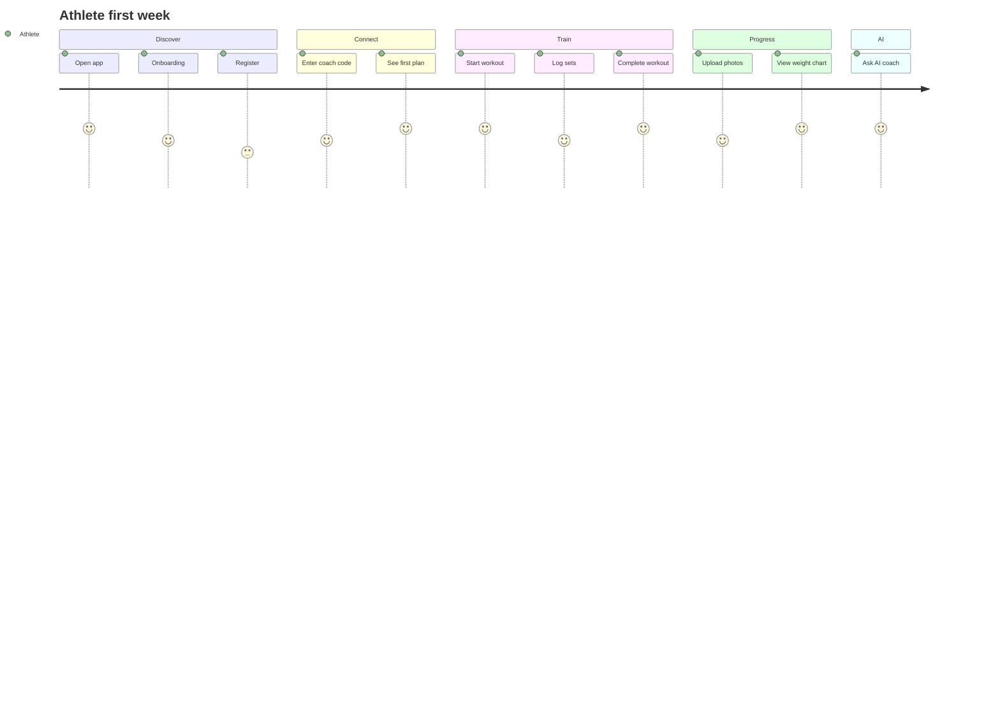

# User Journey Maps

## Journey 1 — Athlete: First week

| Step | Touchpoint | Emotion | Design focus |
|------|------------|---------|--------------|
| 1 | Splash + onboarding | Curious | Brand energy, lime motion |
| 2 | Register | Motivated | Minimal fields, social proof |
| 3 | Join coach | Relieved | Clear code input |
| 4 | Dashboard | Excited | Next workout hero |
| 5 | First workout | Focused | Large set inputs, rest timer |
| 6 | Complete | Proud | Celebration micro-animation |
| 7 | AI chat | Delighted | Purple magic, personalized insight |

---

## Journey 2 — Coach: Assign plan

| Step | Action | Screen |
|------|--------|--------|
| 1 | Open athlete list | C02 |
| 2 | Filter “Needs plan” | C02 sheet |
| 3 | Open athlete profile | C03 |
| 4 | Plans tab → Assign | C05 |
| 5 | Pick template or new | C04 |
| 6 | Customize days | C04 |
| 7 | Push assign | Toast success |
| 8 | Athlete notified | Push (system) |

**Pain point:** Too many taps → **Quick assign** from list row swipe action.

---

## Journey 3 — Progress photos (flagship)

| Step | Screen | Notes |
|------|--------|-------|
| 1 | Progress tab | CTA “Log progress photos” |
| 2 | Pose guide | Front / Side / Back |
| 3 | Camera overlay | Silhouette alignment |
| 4 | Review & crop | Privacy reminder |
| 5 | Upload progress | Skeleton → success |
| 6 | Timeline | Date grouped |
| 7 | Compare | Slider before/after |
| 8 | AI analysis card | Purple; posture/muscle notes |

---

## Journey 4 — AI Generate Plan

| Step | UX |
|------|-----|
| 1 | Tap center AI tab |
| 2 | Mode toggle: Chat \| Generate |
| 3 | Form: goal, experience, equipment, days |
| 4 | “Generate” → thinking state 3–8s |
| 5 | Progress steps animated |
| 6 | Preview plan by day |
| 7 | Edit day or swap exercise |
| 8 | Save to library / assign (coach) |

---

## Journey 5 — Admin: Manage exercise library

| Step | Action |
|------|--------|
| 1 | Login admin portal |
| 2 | Exercises → search duplicate |
| 3 | Edit video URL, muscle tags |
| 4 | Publish → sync to all tenants |
| 5 | Audit log confirmation |

---

## Cross-cutting states (every journey)

| State | Pattern |
|-------|---------|
| Loading | Skeleton matching layout |
| Empty | Illustration + single CTA |
| Error | Inline banner + retry; danger color |
| Offline (PWA) | Banner “Offline — workouts still loggable” |
| Permission denied | Camera / notification education sheet |
